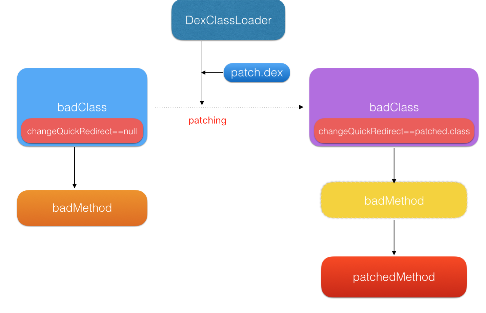

## Android热修复方案比较

热修复的特点：无需重新发版，实时高效热修复；用户无感知修复，无需下载新的应用，代价小；
修复成功率高，把损失降到最低。

### 一、热修复开源方案和使用情况

|方案名称|方案开发公司	|开发时间	|Github星评|
|----|----|----|----|
|Robust|美团|2016年|54|
|Andfix|阿里|2015年|	4994|
|Nuwa|个人开发者（dex文件补丁）|2015年|2588|
|Dexposed|不考虑，需要root权限|		
|Amigo|饿了么（apk补丁）|2016年|1031|
|Tinker	|微信(apk补丁)|2016年|7891|
|RocooFix|Nuwa改进版|	2016年|1299|

### Robust方案
1. 原理：Robust插件对每个产品代码的每个函数都在编译打包阶段自动的插入了一段代码，插入过程对业务开发是完全透明。

