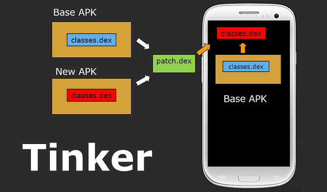

## Android热修复方案比较

热修复的特点：无需重新发版，实时高效热修复；用户无感知修复，无需下载新的应用，代价小；
修复成功率高，把损失降到最低。

### 一、热修复开源方案和使用情况

|方案名称|方案开发公司	|开发时间	|Github星评|
|----|----|----|----|
|Robust|美团|2016年|54|
|Andfix|阿里|2015年|	4994|
|Nuwa|个人开发者（dex文件补丁）|2015年|2588|
|Dexposed|不考虑，需要root权限|		
|Amigo|饿了么（apk补丁）|2016年|1031|
|Tinker	|微信(apk补丁)|2016年|7891|
|RocooFix|Nuwa改进版|	2016年|1299|


### Robust方案

1. 原理：Robust插件对每个产品代码的每个函数都在编译打包阶段自动的插入了一段代码，插入过程对业务开发是完全透明。


在Application中通过DexClassLoader，将补丁class文件事先加载，然后之后会调用新的额
class以替换旧apk中的bug class文件，通过反射进行新代码的调用，以达到热修复目的。

具体过程请参考[Android热更新方案Robust](https://tech.meituan.com/android_robust.html)

2.补丁制作

Robust的补丁制作，除了打包dex文件，更需要使用美团的插件将每个class文件插入代码，在编译阶段侵入代码
对运行效率等方面都有影响

*** 优点 ***
```
1.高兼容和适配性，由于是java代码层面的替换调用，基本不涉及各个版本
的适配和虚拟机的适配。
```

*** 缺点 ***
```
1.由于对包体中的文件进行了代码侵入，对运行效率、方法数、包体积都有
影响，文件方法数变多，企业级应用可能会涉及到65535的问题。
2.项目不够成熟，文档不够健全。
```

### Andfix方案
1.原理：补丁工具apkpatch将两个apk做一次对比，然后找出不同的部分可以看到生成的apatch了文件，
后缀改成zip再解压开，里面有一个dex文件。通过jadx查看一下源码，里面就是被修复的代码所在的类
文件,这些更改过的类都加上了一个_CF的后缀，并且变动的方法都被加上了一个叫@MethodReplace
的annotation，通过clazz和method指定了需要替换的方法。然后客户端sdk得到补丁文件
后就会根据annotation来寻找需要替换的方法。最后由JNI层调用native完成完成指针的替换。`

2.补丁制作

官方提供apkpatch工具
apkpatch -o D:/Patch/ -k debug.keystore -p android-a androiddebugkey -e android f bug-fix.apk t release.apk

*** 优点 ***
```
1.项目成熟，文档健全。
2.集成简单
3.安全性高
```

*** 缺点 ***
```
1.不支持YunOS
2.无法添加新类和新的字段
3.需要使用加固前的apk制作补丁，但是补丁文件很容易被反编译，也就是修改过的类源码容易泄露。
4.使用加固平台可能会使热补丁功能失效
```

### Nuwa方案
1.原理：动态加载补丁dex，并将补丁dex插入到dexElements最前面。要实现热更
新，需要热更新的类要防止被打上ISPREVERIFIED标记

2.补丁制作

Gradle插件要做的事就是拿到所有class，在其构造函数中注入Hack.class，使其直接引用另一个dex中的文件，防止被打上ISPREVERIFIED标记。并且发版时的mapping文件以及所有class文件的hash值的文件需要保持下来打patch使用。

*** 优点 ***
```
1.项目成熟，文档健全。
2.集成简单
3.支持添加新加类和新的字段
```
*** 缺点 ***
```
1.支持gradle1.5以下
2.需要应用重启后生效
```

### Tinker

1.原理：通过新旧apk比较，使用gradle从插件生成.dex补丁文件（并不是真正的dex文件），补丁通过服务器下发后尝试对dex文件二路归并进行合并，最终生成全量的dex文件，与生成补丁互为逆过程，生成全量dex文件后进行optimize操作，最终生成odex文件。在Application中进行反射调用已经合成的dex文件。

2.补丁制作

使用微信gralde插件tinkerPatchRelease任务调用生成补丁

*** 优点 ***
```
1.项目成熟，文档健全。
2.集成简单
3.支持资源文件和so文件的修复替换
```
*** 缺点 ***
```
1.不支持四大组件的添加
2.需要应用重启后生效
```

### RocooFix
1.原理：同Nuwa，因为最适合我们当前的使用，详细介绍下

2.补丁制作

使用gradle插件自动生成包含dex的jar文件

*** 使用过程 ***
```
1.Application中初始化：
    RocooFix.init(this);
    RocooFix.applyPatch(this,path);
2.根目录下build.gradle文件添加:
    classpath 'com.dodola:rocoofix:1.2.2'
3.app中build.gradle文件中添加:
    apply plugin: 'com.dodola.rocoofix'  
    compile 'com.dodola:rocoo:1.1'
    rocoo_fix {
      includePackage = ['com/xiaomi/gamecenter/wxwap']//指定将来可能需要制作补丁的package(就是指定插庄的范围)
      excludeClass = ['HyApplication.class']//将不需要加到patch里的类写在这里(不需要插庄的类)
      preVersionPath = '1'//注意：此项属性只在需要制作补丁的时候才需开启！！如果不需要制作补丁则需要去掉此项
      enable = true//注意：关掉此项会无法生成Hash.txt文件
      scanref=false//默认为 false，开启这个选项会将与补丁 class 相引用的 class 都打入包中来解决 ART 虚拟机崩溃问题，功能 Beta 中
    }
4.更改versionCode 开启混淆，不开混淆的话无法生成补丁文件，可以设定生成补丁的包
5.补丁文件为增量文件，只包含改动的文件，补丁可由我们自己生成，不需要经过cp
```

*** 优点 ***
```
1.项目成熟，文档健全。
2.集成简单
3.支持so文件的修复替换
4.补丁生成与apk无关(增量补丁无关性，不依赖cp等第三方)
```


*** 缺点 ***
```
1.不支持四大组件的添加
2.需要应用重启后生效
```
作者：恶魔殿下_HIM
链接：[https://www.jianshu.com/p/eec0ab6800a4](https://www.jianshu.com/p/eec0ab6800a4)
來源：简书

